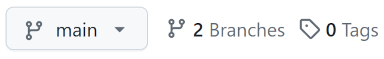

# Remote Tracking Branches {#remote-tracking-branch}

[i[Branch-->Remote tracking]<]

Ta đã thấy cách tạo branch cục bộ để làm việc, sau đó merge trở lại vào branch `main`, rồi `git push` lên máy chủ từ xa.

Phần này của hướng dẫn sẽ cố gắng làm rõ những gì thực sự xảy ra đằng sau hậu trường, đồng thời cho ta cách push branch cục bộ lên remote để lưu trữ an toàn.

## Các Branch trên Remote

[i[Branch-->On remote]<]

Đầu tiên, hãy ôn lại nhanh!

Nhớ rằng repo từ xa mà bạn đã clone về là một bản sao hoàn chỉnh của repo bạn. Repo từ xa có branch `main`, và do đó bản clone của bạn cũng có branch `main`.

Đúng vậy! Khi bạn tạo một repo GitHub rồi clone nó, thực ra có **hai** branch `main`!

Làm sao ta phân biệt chúng?

Trong bản clone cục bộ, ta chỉ dùng tên thuần để gọi các branch. Khi ta nói `main` hay `topic2`, ta có ý là branch cục bộ với tên đó trong repo của mình.

Nếu muốn nói đến một branch trên remote, ta phải đưa tên remote cùng với tên branch theo ký hiệu gạch chéo mà ta đã thấy:

``` {.default}
main            # main branch on your local repo
origin/main     # main branch on the remote named origin
upstream/main   # main branch on the remote named upstream
zork/mailbox    # mailbox branch on the remote named zork
mailbox         # mailbox branch on your local repo
```

Điều quan trọng là không chỉ `origin/main` chỉ branch `main` trên `origin` trong ngôn ngữ thông thường, mà _bạn thực sự có một branch trong repo cục bộ tên là `origin/main`_.

Đây gọi là _remote-tracking branch_ (branch theo dõi remote). Đó là bản sao cục bộ của bạn về branch `main` trên remote. Bạn không thể tự ý di chuyển branch `origin/main` cục bộ; Git làm điều đó cho bạn một cách tự nhiên khi bạn tương tác với remote (ví dụ khi push hoặc pull).

Ta sẽ gọi branch `main` trên máy tính cục bộ là _local branch_ (branch cục bộ), và gọi cái trên `origin` là _upstream branch_ (branch thượng nguồn).

> **Và điều này sẽ gây nhầm lẫn về sau** khi ta đặt tên cho một remote là
> `upstream` theo cách chẳng liên quan gì đến thuật ngữ _upstream branch_
> mà ta đang dùng ở đây.

Tôi muốn đi qua điều này thêm một lần nữa để khắc sâu.

Giả sử bạn có hai branch này trên máy tính vì bạn vừa clone repo từ xa tại `origin`:

``` {.default}
main            # main branch on your local repo
origin/main     # main branch on the remote named origin
```

Khi bạn có hai branch đó trên máy tính, *thực ra có ba branch trên thế giới*.

1. `main` trên máy tính của bạn.
2. `origin/main` trên máy tính của bạn.
3. `main` trên máy tính của `origin`, thường là một máy tính khác so với máy bạn, ví dụ một máy ở GitHub hay gì đó.

Lưu ý rằng hai cái đầu tiên đều ở trên repo trong máy tính của bạn!

Branch `origin/main` chỉ là nơi máy tính của bạn *nghĩ rằng* `main` trên `origin` đang ở. Máy tính của bạn có được thông tin này vào lần cuối cùng bạn pull hoặc fetch từ `origin`.

Nếu người khác đã push lên `main` của `origin` kể từ lần pull cuối của bạn, thì `origin/main` trên máy cục bộ của bạn sẽ không còn cập nhật nữa.

Và thường thì bạn không cần lo lắng nhiều về điều này; khi bạn cố push, Git sẽ thông báo nếu ai đó đã push thay đổi trong thời gian chờ và bạn phải pull trước để cập nhật branch `origin/main` của mình. Không vấn đề gì lớn.

Nhưng tôi muốn giải thích rõ điều đó để bạn có mô hình tư duy đầy đủ hơn về những gì đang xảy ra phía sau hậu trường.

[i[Branch-->On remote]>]

## Liệt Kê Remote Tracking Branches

[i[Branch-->Listing remote tracking]<]

Nhớ rằng `git branch` liệt kê các branch bạn có? Hãy nâng cấp nó để xem tất cả các remote tracking branch luôn. Điều này sẽ giúp trong các phần tiếp theo.

Về cơ bản, ta chỉ cần thêm tùy chọn `-avv` nghĩa là "all" (để liệt kê các remote tracking branch) và "verbose" (để hiện thông tin về commit nào chúng đang trỏ đến) và "verbose" thêm lần nữa (để cho biết remote branch nào ánh xạ đến local branch nào).

Đây là kết quả cho repo chứa mã nguồn cuốn sách này:

``` {.default}
% git branch -avv
  * main                  2d63af5 [origin/main] indexing
    sphinx                cdac325 [origin/sphinx] partial port
    remotes/origin/HEAD   -> origin/main
    remotes/origin/main   2d63af5 indexing
    remotes/origin/sphinx cdac325 partial port
```

Ta thấy hai branch cục bộ của tôi (`main` và `sphinx`). Nhìn vào hai dòng trên cùng đó, bạn thấy remote tracking branch trong dấu ngoặc vuông (`origin/main` và `origin/sphinx`). Khi tôi push hoặc pull từ `main` hay `sphinx`, đó là các remote tracking branch được merge đến.

Ngoài ra, ta thấy thông tin về remote bên dưới đó.

Dòng đầu tiên về `remotes/origin/HEAD` hơi kỳ lạ. Nó chỉ trỏ đến `origin/main`, đơn giản là cho ta biết rằng `main` là branch khởi đầu của repo mà Git sẽ dùng khi bạn clone nó. Thường thì bạn không cần nghĩ đến dòng này.

Hai dòng còn lại cho ta biết các commit mà remote tracking branch `origin/main` và `origin/sphinx` đang trỏ đến. Nhìn kỹ, ta thấy chúng đang trỏ đến cùng commit với `main` và `sphinx` cục bộ của ta, nghĩa là mọi thứ đang đồng bộ. (Theo như ta biết --- ai đó có thể đã push thứ gì đó lên repo sau lần pull cuối của ta mà ta chưa hay.)

[i[Branch-->Listing remote tracking]>]

## Push Lên Remote

[i[Branch-->Set upstream]<]

Thú vị đây: khi bạn push hoặc pull, về mặt kỹ thuật bạn chỉ định remote và branch muốn dùng. Đây là tôi đang nói, "Push branch tôi đang ở ngay lúc này (giả sử là `main`) và merge nó vào `main` trên `origin`."

[i[Push-->Branch to remote]]
[i[Branch-->Pushing to remote]]
``` {.default}
$ git push origin main
```

"Nhưng đợi đã! Tôi chưa bao giờ làm vậy!"

Hóa ra có một tùy chọn bạn có thể đặt để điều đó xảy ra tự động. Giả sử bạn đang ở branch `main` và chạy lệnh này:

``` {.default}
$ git push --set-upstream origin main
$ git push -u origin main              # same thing, shorthand
```

Lệnh này sẽ làm hai việc:

1. Push các thay đổi trên `main` cục bộ lên máy chủ từ xa (đó là phần `push origin main`).
2. Nhớ rằng branch `main` cục bộ đang theo dõi branch từ xa `origin/main` (đó là phần `-u`).

Và sau đó, từ đây về sau, từ branch `main`, bạn chỉ cần:

``` {.default}
$ git push
```

và nó sẽ tự động push lên `main` trên `origin` (và cập nhật branch `origin/main` của bạn) nhờ vào việc bạn đã dùng `--set-upstream` trước đó.

Và `git pull` cũng có tùy chọn tương tự, mặc dù bạn chỉ cần làm một lần với push hoặc pull là đủ.

"Nhưng đợi đã! Tôi cũng chưa bao giờ dùng `--set-upstream`!"

Vì mặc định khi bạn clone một repo, Git tự động thiết lập branch cục bộ để theo dõi branch `main` trên remote.

> **Tùy thuộc vào cách bạn tạo repo, bạn cũng có thể có tham chiếu đến
> `origin/HEAD`.** Có thể hơi kỳ lạ khi nghĩ rằng có một ref `HEAD` trên
> máy chủ từ xa mà bạn có thể thấy, nhưng trong trường hợp này nó chỉ đơn
> giản là chỉ đến branch mà bạn sẽ checkout mặc định khi clone repo.

"OK, vậy ý bạn là tôi chỉ cần `git push` và `git pull` như thường lệ và bỏ qua mọi thứ bạn vừa viết trong phần này?"

Ừ thì... đúng. Kiểu kiểu. Không hẳn. Ta sẽ dùng điều này để push các branch khác lên remote!

[i[Branch-->Set upstream]>]

## Tạo Branch và Push Lên Remote

[i[Push-->Branch to remote]<]

Tôi sẽ tạo một branch cục bộ mới `topic99`:

``` {.default}
$ git switch -c topic99
  Switched to a new branch 'topic99'
```

Và thực hiện một số thay đổi:

``` {.default}
$ vim README.md        # Create and edit a README
$ git add README.md
$ git commit -m "Some important additions"
```

Trong log, ta có thể thấy tất cả các branch đang ở đâu:

``` {.default}
commit 79ddba75b144bad89e1cbd862e5f3b3409f6c498 (HEAD -> topic99)
Author: User Name <user@example.com>
Date:   Fri Feb 16 16:44:50 2024 -0800

    Some important additions

commit 3be2ad2c31b627b431af8c8e592c01f4b989d621 (origin/main, main)
Author: User Name <user@example.com>
Date:   Fri Feb 16 16:14:13 2024 -0800

    Initial checkin
```

`HEAD` trỏ đến `topic99`, và đó là một commit phía trước `main` (cục bộ) và `main` (upstream trên remote `origin`), theo như ta biết. Và ta biết điều đó vì nó đứng trước remote-tracking branch `origin/main` một commit.

Bây giờ hãy push!

``` {.default}
$ git push
  fatal: The current branch topic99 has no upstream branch.
  To push the current branch and set the remote as upstream, use

      git push --set-upstream origin topic99

  To have this happen automatically for branches without a tracking
  upstream, see 'push.autoSetupRemote' in 'git help config'.
```

Ối. Tóm lại, ta đã nói "push", và Git nói, "Push đến đâu? Bạn chưa liên kết branch này với bất kỳ thứ gì trên remote!"

Và quả là ta chưa. Không có remote-tracking branch `origin/topic99`, và chắc chắn cũng chưa có branch `topic99` trên remote đó. Chưa thôi.

Sửa thì đơn giản --- Git đã nói cho ta biết phải làm gì rồi.

[i[Branch-->Set upstream]]

```{.default}
$ git push --set-upstream origin topic99
```

Và xong.

[i[GitHub-->Branches]]

Tại thời điểm này, giả sử bạn đã push lên GitHub, bạn có thể vào trang GitHub cho dự án và ở góc trên bên trái bạn sẽ thấy thứ gì đó trông như Figure_#.1.



Nếu bạn kéo xuống nút `main` đó, bạn sẽ thấy `topic99` ở đó nữa. Bạn có thể chọn một trong hai branch và xem trong giao diện GitHub.

[i[Push-->Branch to remote]>]

## Xóa Remote Tracking Branches

[i[Branch-->Deleting remote]<]
[i[Branch-->Deleting remote tracking]<]

Có một vài tình huống có thể xảy ra ở đây.

1. Ai đó xóa branch trên remote, nhưng remote tracking branch tương ứng (cái trong bản clone của bạn) vẫn còn và bạn muốn xóa nó.

2. Bạn muốn xóa remote tracking branch của mình, và muốn giữ nguyên branch tương ứng trên remote.

3. Bạn xóa remote tracking branch của mình và cũng muốn xóa branch tương ứng trên remote.

Trong tất cả các trường hợp này, tốt nhất là working tree sạch sẽ trước đã.

### Fetch Các Branch Remote Đã Bị Xóa

Cái đầu tiên khá dễ. Hãy bảo Git xóa tất cả remote tracking branch không còn tồn tại trên remote `origin`:

[i[Fetch-->Pruning remote tracking branches]]
``` {.default}
$ git fetch --prune
```

hoặc nếu bạn muốn chỉ định một remote:

``` {.default}
$ git fetch --prune someremote
```

hoặc nếu muốn prune (tỉa) tất cả remote:

``` {.default}
$ git fetch --prune --all
```

### Xóa Remote Tracking Branch của Bạn

Trong trường hợp này, bạn có một remote tracking branch trong bản clone mà bạn muốn xóa. Nhưng bạn không muốn xóa branch đó trên máy chủ.

Dùng `-d` để xóa và `-r` cho remote:

``` {.default}
$ git branch -dr remote/branch
``` 

Ví dụ:

``` {.default}
$ git branch -dr origin/topic99
``` 

### Xóa Branch trên Remote

Cuối cùng, giả sử bạn đã xóa remote tracking branch trong bản clone như hướng dẫn trên, và bạn cũng muốn xóa nó trên remote.

Ta sẽ (có thể bất ngờ) dùng `git push` cho việc này.

Để xóa một branch trên remote, bạn:

``` {.default}
$ git push someremote --delete branchname
``` 

Ví dụ:

``` {.default}
$ git push origin --delete topic99
``` 

Vậy là xong! Hãy chắc chắn xóa remote tracking branch của bạn nếu chưa làm.

[i[Branch-->Deleting remote]>]
[i[Branch-->Deleting remote tracking]>]

## Nhiều Remote

[i[Remote-->Multiple]<]

Bạn có thể có nhiều remote. (Điều này thường xảy ra khi bạn fork repo của ai đó trên GitHub.)

Remote tracking branch hoạt động thế nào trong trường hợp đó?

Giả sử remote chính của bạn là `origin` như thường lệ. Nhưng bạn cũng đã thiết lập một remote khác gọi là `remote2`, tên hơi thiếu sáng tạo.

Ai đó push một branch mới tên `foobranch` (sáng tạo hơn một chút) lên `remote2` và bạn muốn lấy nó về.

Vậy bạn làm thế này:

[i[Fetch]]

``` {.default}
$ git fetch remote2
  remote: Enumerating objects: 15, done.
  remote: Counting objects: 100% (15/15), done.
  remote: Compressing objects: 100% (4/4), done.
  remote: Total 12 (delta 6), reused 11 (delta 5), pack-reused 0
  Unpacking objects: 100% (12/12), 1.61 KiB | 34.00 KiB/s, done.
  From github.com:user/somerepo
   * [new branch]      foobranch -> remote2/foobranch
```

Ổn rồi. Hãy switch sang nó:

``` {.default}
$ git switch foobranch
  branch 'foobranch' set up to track 'remote2/foobranch'.
  Switched to a new branch 'foobranch'
```

Đợi đã! Ta đang track ở `remote2`? Hơi kỳ vì đó là repo của người khác. Có thể bạn có quyền ghi vào đó và đó là điều bạn muốn. Nhưng nhiều khả năng hơn là bạn muốn có phiên bản branch này trong repo của mình nữa.

Bạn có thể làm điều đó bằng cách push nó lên remote của mình với `-u` một lần nữa.

``` {.default}
$ git push -u origin foobranch
```

Và xong rồi.

Nếu bạn xem các branch với `git branch -avv`, bây giờ bạn sẽ thấy nhiều biến thể `foobranch` cho các clone khác nhau.

``` {.default}
foobranch
remotes/origin/foobranch
remotes/remote2/foobranch
```

Nếu bạn muốn giữ `origin/foobranch` đồng bộ với cái trên `remote2`, bạn sẽ phải merge nhiều lần.

[i[Fetch]]

``` {.default}
$ git fetch remote2            # Get remote2 changes
$ git switch foobranch         # Get onto the merge-into branch
$ git merge remote2/foobranch  # Merge changes from remote2
$ git push origin foobranch    # Push changes back to origin
```

(Bạn có thể bỏ `origin foobranch` khỏi lệnh `push` nếu bạn đã push với `-u` trước đó, tất nhiên.)

Tại thời điểm đó, mọi `foobranch` đều nên ở cùng một commit.

[i[Remote-->Multiple]>]
[i[Branch-->Remote tracking]>]
