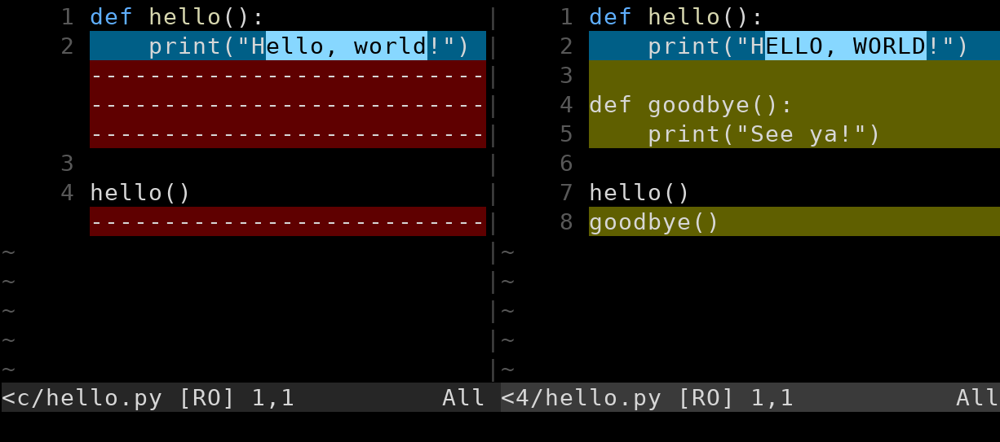

# Difftool

[i[Difftool]<]

Thừa nhận rằng output diff này khó đọc. Tôi thề, bạn sẽ quen với nó. Tôi dùng nó mọi lúc.

Dẫu vậy, đôi khi sẽ thoải mái hơn khi nhìn thứ gì đó *trực quan* hơn, kiểu như phiên bản cũ ở bên trái và phiên bản mới ở bên phải theo cách dễ hiểu hơn.

> **Nếu bạn đang dùng VS Code hay một số IDE khác, bạn sẽ có tính năng diff gọn đẹp miễn phí và không nhất thiết phải chú ý phần này.** Xem thêm trong chương VS Code.

Trước tiên, tin xấu là Git không hỗ trợ điều này ngay từ đầu.

Tin tốt là có rất nhiều công cụ của bên thứ ba làm được điều đó, và bạn có thể kết nối chúng để hoạt động với Git rất dễ dàng.

Dễ như thế nào?

Sau khi thiết lập, bạn có thể chỉ cần viết `difftool` thay vì `diff` trên dòng lệnh. Ví dụ:

``` {.default}
$ git difftool HEAD~3^!
```

Và điều đó mang lại cho bạn gì? Với tôi, người dùng Vim và đã thiết lập Vimdiff làm difftool, nó cho tôi màn hình như trong Hình_#.1.



Có thể hơi khó nhìn khi in đen trắng, nhưng chúng ta có phiên bản cũ ở bên trái và phiên bản mới ở bên phải. Các dấu trừ ở bên trái chỉ ra các dòng không tồn tại trong phiên bản cũ, và chúng ta có thể thấy các dòng được đánh dấu ở bên phải tồn tại trong phiên bản mới.

Nhưng nếu bạn thử chạy `git difftool` ngay bây giờ, nó sẽ không hoạt động. Bạn phải cấu hình trước.

## Cấu Hình

[i[Difftool-->Configuration]<]

Thứ nhất, Git thường nhắc bạn trước khi khởi động difftool của bên thứ ba. Điều này khá phiền, vậy hãy tắt nó đi toàn cục:

``` {.default}
$ git config --global difftool.prompt false
```

Thứ hai, chúng ta cần bảo nó dùng công cụ nào.

``` {.default}
$ git config --global diff.tool vimdiff
```

Và có thể chỉ vậy là đủ. Nếu `vimdiff` (hoặc bất kỳ công cụ diff nào bạn đang dùng) có trong `PATH`[^43a2] của bạn, bạn đã sẵn sàng.

[^43a2]: Việc đặt `PATH` nằm ngoài phạm vi hướng dẫn này, nhưng tóm lại là nếu bạn có thể chạy lệnh công cụ diff trên dòng lệnh (ví dụ bằng cách chạy `vimdiff`), thì nó đã có trong `PATH`. Nếu nó báo `command not found` hay tương tự, thì nó **không** có trong `PATH`. Tìm kiếm trên mạng để biết cách thêm gì đó vào `PATH` trong Bash. Hoặc đặt đường dẫn cấu hình Git một cách tường minh, như được hiển thị trong đoạn tiếp theo.

Nếu nó không có trong `PATH`, có thể vì bạn cài đặt nó cục bộ trong thư mục home của mình ở đâu đó, bạn có thể thêm nó vào `PATH` (tìm kiếm trên mạng), *hoặc* bạn có thể chỉ định đường dẫn đầy đủ đến difftool của mình. Đây là ví dụ với `vimdiff`, thừa với tôi vì `/usr/bin` đã có trong `PATH` của tôi rồi.

``` {.default}
$ git config --global difftool.vimdiff.path /usr/bin/vimdiff
```

Nếu bạn đang dùng difftool khác không phải `vimdiff`, hãy thay thế phần đó trong dòng config bằng tên lệnh của công cụ đó.

Nhắc lại, bạn chỉ cần đặt path nếu công cụ không được cài đặt ở vị trí tiêu chuẩn.

[i[Difftool-->Configuration]>]

## Các Difftool Có Sẵn

Có một số công cụ diff ngoài kia để bạn lựa chọn. Đây là danh sách một phần, với lưu ý rằng tôi chỉ từng dùng Vimdiff.

* [fl[Araxis Merge|https://www.araxis.com/merge/index.en]]
* [fl[Beyond Compare|https://www.scootersoftware.com/]]
* [fl[DiffMerge|https://sourcegear.com/diffmerge/]]
* [fl[Kdiff3|https://kdiff3.sourceforge.net/]]
* [fl[Kompare|https://apps.kde.org/kompare/]]
* [fl[Meld|https://meldmerge.org/]]
* [fl[P4Merge|https://www.perforce.com/products/helix-core-apps/merge-diff-tool-p4merge]]
* Vimdiff (đi kèm [fl[Vim|https://www.vim.org/]])
* [fl[WinMerge|https://winmerge.org/?lang=en]]

Một số miễn phí, một số có trả phí, và một số dùng thử miễn phí.

Và nhớ rằng, VS Code có chức năng này mà không cần dùng difftool.

[i[Difftool]>]
